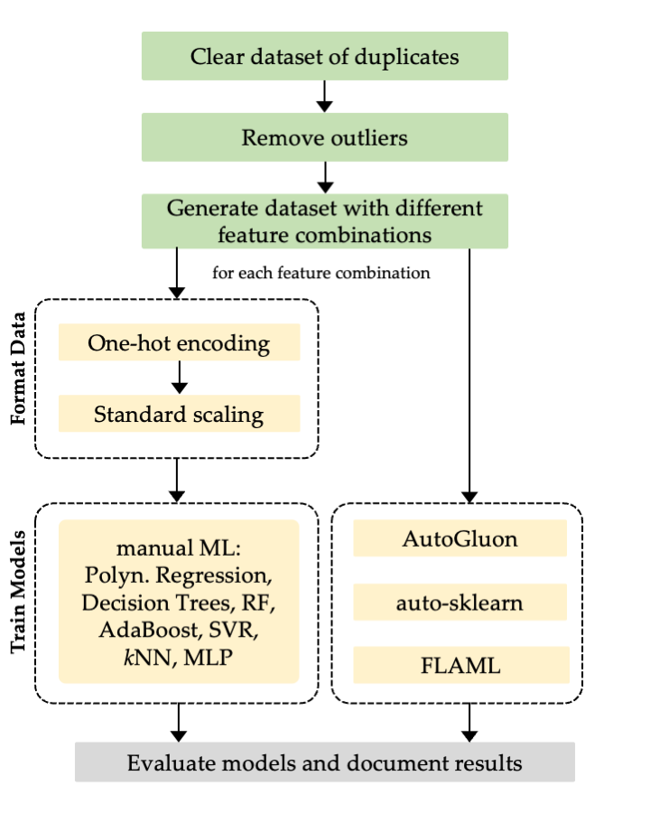

# Benchmarking ML & AutoML methods for price forecasting applications
The presented framework examins and compares different ML and AutoML methods for predicting the price for used construction machines. 
The data has been cleaned in advance and preprocessed (scaled and one-hot-encoded) for the ML methods.

The following **ML methods** are integrated:

- Polynomial Regression
- Decision Trees
- Random Forests
- Adaptive boosting (AdaBoost)
- Support Vector Regression (SVR)
- k-Nearest Neighbors (kNN)
- Multi-Layer Perceptron (MLP) (Deep Learning)

The following **AutoML methods** are integrated:

- [Auto-sklearn](https://automl.github.io/auto-sklearn/master/index.html#)
- [AutoGluon](https://auto.gluon.ai/stable/index.html#)
- [FLAML](https://github.com/microsoft/FLAML)

## Grafical overview


<p align="center">
    
    <br>
</p>

The grafical overview illustrates the steps of the data processing phase in green, which are not part of the framework, and the ML phase in yellow. One-hot encoding and standard scaling are only applied to the manually implemented ML methods.

## Requirements

**Two separate conda environments** for auto-sklear/FLAML and AutoGluon are needed.

Requirements for the auto-sklearn & FLAML environment:

- python
- auto-sklearn
- FLAML
- pandas, matplotlib, seaborn, numpy, yaml, python-docx

Requirements for the AutoGluon environment:

- python
- AutoGluon
- pandas, matplotlib, seaborn, numpy, yaml, python-docx 

## Usage

Execute

```bash
./control.sh 
```
to run the framework.

### Arguments

The execution can be controled via the following arguments, which can be modified within the control.sh file

- **algorithms**: define the methods that should be executed
- **measurements**: set the number of repetitions
- **autosk\_time\_for\_task**: set the time\_left\_for\_this\_task auto-sklearn parameter
- **autosk\_runtime\_limit**: set the per\_run\_time\_limit auto-sklearn parameter
- **document\_results**: set this parameter to True to generate a docx document at the end of the execution

